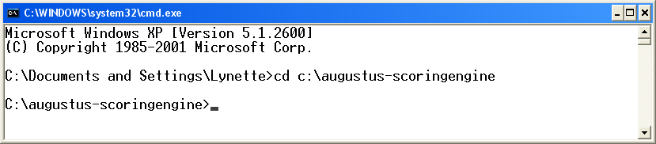
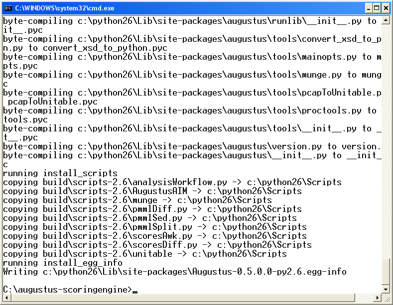
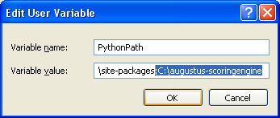
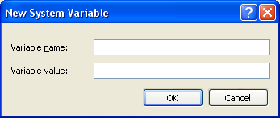

.. raw:: latex

    \newpage

.. index :: Installation, Windows

.. _`Installation-on-Windows`:

Installation on Windows
-----------------------

.. note:: 

   When running the Augustus from the scripts in its :file:`bin` directory,
   you have to specify the entire path to those files.  There is a section on
   setting up the use of Python executable scripts for windows at the main
   Python site.  See section 3.3.4 at:
   `<http://docs.python.org/using/windows.html>`_

Dependencies
^^^^^^^^^^^^

Python is available for Windows and can be downloaded from:
`<http://www.python.org/getit/windows/>`_
You can use any of Python 2.5, 2.6, or 2.7.  Python devotes a section of its
official documentation to Windows.  It can be found at:
`<http://docs.python.org/using/windows.html>`_.

A Windows version of NumPy is available from sourceforge:
`<http://sourceforge.net/projects/numpy/files/NumPy/>`_.

Augustus
^^^^^^^^

The most recent Augustus release can be downloaded from the google code site at
`<http://code.google.com/p/augustus/downloads/list/>`_ or can be checked out
using Subversion. There are many Subversion clients for Windows, including
TortoiseSVN (`<http://tortoisesvn.tigris.org/>`_) and Subclipse
(`<http://subclipse.tigris.org/>`_), a plugin for Eclipse.

Installation
^^^^^^^^^^^^

If Augustus was downloaded, open the archive.

The computer we are using runs Windows XP.  Python 2.6 is installed at
:file:`C:\\Python26` and the Augustus tarball was expanded to
:file:`C:\\augustus-scoringengine`.

To install Augustus, either change into the installation directory and run the
:file:`setup.py` script, or modify the :envvar:`PythonPath` environment
variable.

:file:`setup.py`
""""""""""""""""

First, open a command window: click on :menuselection:`Start --> run`, and then
type ``cmd`` in the dialog box.

.. raw:: latex

    \\[0.2cm] \nopagebreak

.. image:: IMG/augustus_windows/win_install_01.png
    :width: 40%
    :alt: the start (arrow) run window, with 'cmd' entered
    :align: left

.. raw:: html

    

.. raw:: latex

    \vspace{9pt} \newpage

Change directories to where Augustus was installed.

.. raw:: latex

    \\[0.2cm] \nopagebreak

.. raw:: html

    

.. raw:: latex

    \vspace{9pt} \newline \pagebreak[2]

Run :file:`setup.py` with the install option by typing::

    C:\Python26\python.exe setup.py install

The installation script should run. It places Augustus in the usual directories
for Python.:

.. raw:: latex

    \\[0.2cm] \nopagebreak

.. raw:: html

    

.. raw:: latex

    \vspace{9pt} \newpage

If Augustus is visible to Python, it should be possible to load Augustus
modules, like unitable, from outside of the installation directory.  Change
back to :file:`C:\\` or another directory outside of Augustus, and start the
Python interactive environment.

.. raw:: latex

    \\[0.2cm] \nopagebreak

.. image:: IMG/augustus_windows/win_install_04.png
    :width: 90%
    :alt: invoking a Python interactive session
    :align: left

.. raw:: latex

    \vspace{9pt} \newline \pagebreak[2]

.. raw:: html

    

Then type::

    >>> from augustus import *
    >>> import augustus.kernel.unitable as uni
    >>> exit()

If there are no error messages, Python was able to find
Augustus and its modules.  The session should look like
the following:

.. raw:: latex

    \\[0.2cm] \nopagebreak

.. image:: IMG/augustus_windows/win_install_05.png
    :width: 90%
    :alt: successful import of Augustus's UniTable
    :align: left

.. raw:: html

    

.. raw:: latex

    \vspace{9pt} \newline \pagebreak[2]

Augustus is successfully installed.

.. raw:: latex

    \vspace{9pt} \newpage

Editing the :envvar:`PythonPath`
""""""""""""""""""""""""""""""""

To use Augustus without running the installation script :file:`setup.py`, edit
the :envvar:`PythonPath` environment variable to make Augustus's directories
visible to Python.  First, find out what is currently in the :envvar:`PythonPath`
environment variable.  Open a command window: click on
:menuselection:`Start --> run`.

.. raw:: latex

    \\[0.2cm] \nopagebreak

.. image:: IMG/augustus_windows/win_install_06.png
    :width: 40%
    :alt: start (arrow) run selection to open a command window
    :align: left

.. raw:: html

    

.. raw:: latex

    \vspace{9pt} \newline \pagebreak[2]

You may or may not already have a :envvar:`PythonPath` set up.  To see an
environment variable, enclose the variable names in percent (%) signs.  For
:envvar:`PythonPath`, use the command ``echo %PythonPath%``.

.. raw:: latex

    \\[0.2cm] \nopagebreak

.. image:: IMG/augustus_windows/win_install_07.png
    :width: 90%
    :alt: shell session showing PythonPath environment variable
    :align: left

.. raw:: html

    

.. raw:: latex

    \vspace{9pt} \newline \pagebreak[2]

Use the System Properties widget to add or modify environment variables. Click
on: :menuselection:`Start`, right-click on :menuselection:`My Computer`, and
then click on :menuselection:`Properties`.  The System Properties window will
open.  Click on the :guilabel:`Advanced` tab.

.. raw:: latex

    \\[0.2cm] \nopagebreak

.. image:: IMG/augustus_windows/win_install_08.png
    :width: 50%
    :alt: System Properties window, with Advanced Tab open
    :align: left

.. raw:: html

    

.. raw:: latex

    \vspace{9pt} \newpage

Near the bottom of the :guilabel:`Advanced` tab is the
:guilabel:`Environment Variables` button.  Click on it to edit both user-specific
and system variables.  The Environment Variables window appears:

.. raw:: latex

    \\[0.2cm] \nopagebreak

.. image:: IMG/augustus_windows/win_install_09.png
    :width: 50%
    :alt: Environment Variables window, with PythonPath selected
    :align: left

.. raw:: html

    

.. raw:: latex

    \vspace{9pt} \newline \pagebreak[2]

There are two sections; one for User variables and one for System variables. The
User variables are defined for the individual user.  Windows reloads these every
time a new command window is open.  The System variables are defined for all
users on the system.  Windows will reload these every time a new user logs in.
If it is not appropriate to create :envvar:`PythonPath` for all users, create it
instead under :menuselection:`Environment Variables --> User Variables` rather
then :menuselection:`Environment Variables --> System Variables`.

Edit the :envvar:`PythonPath`  environment variable to include the path to
Augustus, or add a new variable if it does not exist.  If you add a new
variable when one already exists, the new varialbe overwrites the old.

To add a new variable, click on :guilabel:`New` .  To append to an existing
path, click on :guilabel:`Edit`. Type a semicolon and then the path to where
Augustus was installed. In this case, we add  ``;C:\augustus-scoringengine`` to
the path as shown:

.. raw:: latex

    \\[0.2cm] \nopagebreak

.. raw:: html

    

.. raw:: latex

    \vspace{9pt} \newpage

You may want to append the Python executable path to the environment variable
:envvar:`Path` to avoid having to type the entire path every time you invoke
Python from the command line. :envvar:`Path` is already listed in the System
Variables for this machine, highlighted below.

.. raw:: latex

    \\[0.2cm] \nopagebreak

.. image:: IMG/augustus_windows/win_install_11.png
    :width: 50%
    :alt: Environment Variables window with Path variable highlighted
    :align: left

.. raw:: html

    

.. raw:: latex

    \vspace{9pt} \newline \pagebreak[2]

To add the path to the Python executable for only your user session, add the
modification for :envvar:`Path` to your User variables.  Click on
:guilabel:`New` under the User variables section to open a dialog box for a New
User Variable.

.. raw:: latex

    \\[0.2cm] \nopagebreak

.. raw:: html

    

.. raw:: latex

    \vspace{9pt} \newline \pagebreak[2]

Under :guilabel:`Variable name`  type ``Path`` and under
:guilabel:`Variable value` type ``%PATH%;C:\Python26\``.

.. raw:: latex

    \\[0.2cm] \nopagebreak

.. image:: IMG/augustus_windows/win_install_13.png
    :width: 40%
    :alt: Dialog box with %Path%;c:\Python26\ added
    :align: left

.. raw:: html

    

.. raw:: latex

    \vspace{9pt} \newline \pagebreak[2]

Click :guilabel:`OK`.  You will have to accept all changes, close the System
Properties window, close the :program:`cmd` window, and then open a new
:program:`cmd` window for the changes to take effect in your session.

.. raw:: latex

    \newpage

Once you open a new :program:`cmd` window, you can check that
:file:`C:\\Python26` has been appended to the :envvar:`Path`
environment variable.  If so, you can now type ``python`` at the command prompt
instead of ``C:\Python26\python.exe`` to invoke an interactive session of 
Python.  An example showing the new path and a successful invocation of the
interactive session is below:

.. raw:: latex

    \\[0.2cm] \nopagebreak

.. image:: IMG/augustus_windows/win_install_14.png
    :width: 90%
    :alt: Interactive session with Path and python invocation
    :align: left

.. raw:: html

    

.. raw:: latex

    \vspace{9pt} \newline \pagebreak[2]

You can also check that Augustus has been added to your :envvar:`PythonPath`
environment variable:

.. raw:: latex

    \\[0.2cm] \nopagebreak

.. image:: IMG/augustus_windows/win_install_15.png
    :width: 90%
    :alt: Interactive session showing PythonPath
    :align: left

.. raw:: html

    

.. raw:: latex

    \vspace{9pt} \newline \pagebreak[2]

The paths look OK.  Check that you can use modules from Augustus.  At the
:program:`cmd` prompt, type::

    C:\> python

to invoke Python.  Then type::

    >>> from augustus import *
    >>> import augustus.kernel.unitable as uni
    >>> exit()

.. raw:: latex

    \newpage

If there are no error messages, then Python is able to find Augustus and its
modules.  The session should look like the following:
                
.. raw:: latex

    \\[0.2cm] \nopagebreak

.. image:: IMG/augustus_windows/win_install_16.png
    :width: 90%
    :alt: Successful Python import of Augustus's UniTable
    :align: left

.. raw:: html

    

.. raw:: latex

    \vspace{9pt} \newline \pagebreak[2]

Augustus is successfully installed.

Updates are visible in GUI environments
"""""""""""""""""""""""""""""""""""""""

The environment update is also recognized in :program:`IDLE`, the graphical
user interface that ships with the Windows version of Python.  A screenshot of
the GUI is shown here:

.. raw:: html

   

.. raw:: latex

    \\[0.2cm] \nopagebreak

.. image:: IMG/augustus_windows/win_install_17.png
    :width: 95%
    :alt: The IDLE Python GUI shell that ships with Windows.
    :align: left

.. raw:: latex

    \vspace{9pt} \newline \pagebreak[2]

.. raw:: html

   

    

.. note::
    For older versions of Augusuts to run on Windows, the ``resources`` module
    import and its use with metadata logging may have be commented out in
    :file:`augustus/pmmllib/pmmlConsumer.py`, because the module was called but
    is not available on Windows.  This impacted versions 264 to 346 of the file.
    Before that, the module was not used and since then, the platform is checked
    before performing the import.
